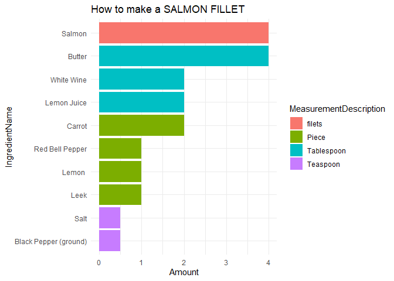

Ingredients to make Salmon Filet
================

``` r
library(dplyr)
library(DBI)
library(dbplyr)
library(odbc)

# odbcListDrivers()

con <- DBI::dbConnect(odbc(),
                      Driver = "ODBC Driver 17 for SQL Server",
                      Server = "mcobsql.business.nd.edu",
                      UID = "MSBAstudent",
                      PWD = "SQL%database!Mendoza",
                      Port = 3306, 
                      Database = "RecipesExample")


# dbListFields(con, "Recipe_Ingredients")
# 
# dbListFields(con, "Recipes")
# 
# dbListFields(con, "Ingredients")
# 
# dbListFields(con, "Measurements")


select_q <- dbSendQuery(
  conn = con, 
  statement = "SELECT RecipeTitle, IngredientName, Amount, MeasurementDescription, Preparation, Notes
FROM dbo.Recipe_Ingredients ri 
INNER JOIN dbo.Recipes r 
ON ri.RecipeID = r.RecipeID
INNER JOIN dbo.Ingredients i  
ON i.IngredientID = ri.IngredientID
INNER JOIN dbo.Measurements m 
ON m.MeasureAmountID = ri.MeasureAmountID
WHERE RecipeTitle LIKE '%Salmon%'
ORDER BY Amount DESC"
)

select_res <- dbFetch(select_q)
```

``` r
select_res$IngredientName <- reorder(select_res$IngredientName, select_res$Amount, decreasing = FALSE)
library(ggplot2)

ggplot(select_res, aes(x = IngredientName, y = Amount, fill = MeasurementDescription)) + 
         geom_bar(stat = "identity") + labs(title = "How to make a SALMON FILLET") +
         theme_minimal() +
  coord_flip()
```

<!-- -->
